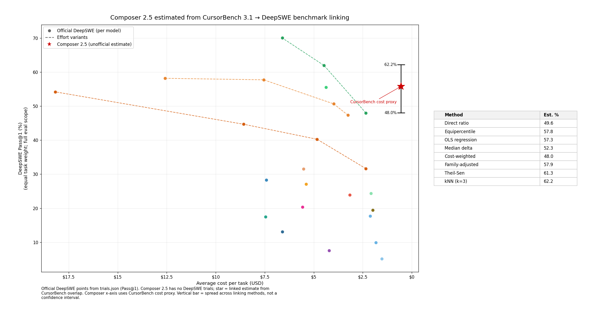

# composer-deepswe-estimation

**Unofficial, reproducible estimate of Composer 2.5 on DeepSWE-style coding-agent benchmarks**

This repository provides a reproducible, unofficial estimation of Composer 2.5 performance on DeepSWE-style coding-agent benchmarks. The estimate is derived from available benchmark mappings and multiple transparent estimation methods. It should **not** be interpreted as an official benchmark submission.

## Key result (with public DeepSWE trials)

When `trials.json` from [deepswe.datacurve.ai](https://deepswe.datacurve.ai/) is provided locally, the current linking pipeline yields approximately:

| Statistic | Estimated DeepSWE Pass@1 |
| --- | ---: |
| Median across methods | ~57.6% |
| Mean across methods | ~58.0% |
| Method spread (min–max) | ~48.0% – 62.2% |
| Conservative anchor (`robust_median_ratio`) | ~52.3% |

Composer 2.5 CursorBench 3.1 reference: **63.2%** pass rate, **$0.55**/task cost proxy.



*Official DeepSWE model points from `trials.json` (Pass@1). Red star = unofficial Composer 2.5 estimate linked from CursorBench overlap. Vertical bar = spread across eight linking methods (not a confidence interval). Composer x-position uses a CursorBench cost proxy.*

> **Disclaimer:** These are **estimates** from cross-benchmark linking (n≈14 overlap pairs). Composer has no public DeepSWE trials. Method spread is **not** a confidence interval. See [limitations.md](limitations.md).

## Repository structure

```text
composer-deepswe-estimation/
  README.md                 # This file
  methodology.md            # Estimation methods and metrics
  limitations.md            # Caveats and responsible use
  requirements.txt
  scripts/
    parse_results.py        # Raw → normalized CSV
    estimate_composer.py    # Linking methods + summary
    plot_results.py         # Matplotlib figures
    generate_report.py      # Markdown report
    common.py               # Shared logic
  data/raw/                 # Input artifacts
  data/processed/           # normalized_results.csv
  results/                  # estimates.csv, summary.json
  figures/                  # PNG plots
  reports/                  # Generated Markdown report
```

## Setup

```bash
git clone https://github.com/RayhanHaqi/composer-deepswe-estimation.git
cd composer-deepswe-estimation
python -m venv .venv
source .venv/bin/activate
pip install -r requirements.txt
```

## Usage

### 1) Quick test on synthetic example data

```bash
python scripts/parse_results.py --files data/raw/example_model_results.csv --output data/processed/normalized_results.csv
python scripts/estimate_composer.py --input data/processed/normalized_results.csv --output-dir results/
python scripts/plot_results.py --input data/processed/normalized_results.csv --estimates results/estimates.csv --output-dir figures/
python scripts/generate_report.py --input data/processed/normalized_results.csv --output reports/composer_deepswe_estimate.md
```

### 2) Full estimate with public DeepSWE artifacts

If `data/raw/trials.json` is not present, download it (~22 MB) or symlink from an existing copy (e.g. `../deepswe/trials.json`):

```bash
ln -sf ../deepswe/trials.json data/raw/trials.json
ln -sf ../deepswe/tasks.json data/raw/tasks.json
```

Or download:

```bash
curl -L -o data/raw/trials.json https://deepswe.datacurve.ai/artifacts/trials.json
```

Run the pipeline:

```bash
bash scripts/run_full.sh
```

### Script help

```bash
python scripts/parse_results.py --help
python scripts/estimate_composer.py --help
python scripts/plot_results.py --help
python scripts/generate_report.py --help
```

## Methodology summary

1. Normalize CursorBench and DeepSWE results to a common schema.
2. Match rows on `model_norm` + `effort_norm`.
3. Apply eight transparent linking methods at Composer's CursorBench score.
4. Summarize min/max/mean/median across methods.
5. Plot DeepSWE models vs the unofficial Composer estimate.

Details: [methodology.md](methodology.md)

## Reproduce the headline numbers

Requirements:

- `data/raw/cursorbench_3_1_reference.csv` (included)
- `data/raw/trials.json` (download from DeepSWE)
- Python dependencies from `requirements.txt`

Then run the four scripts in order (see above). Check `results/summary.json` for the numeric range.

## What you still need to provide

| Item | Status in repo |
| --- | --- |
| CursorBench 3.1 reference table | Included (`cursorbench_3_1_reference.csv`) |
| DeepSWE `trials.json` | **Use local copy** (symlink/download; not committed) |
| Official Composer 2.5 DeepSWE trials | **Not available** — estimate only |
| Pinning harness/build versions | Document in your fork if you publish |

## Limitations

See [limitations.md](limitations.md) for benchmark mismatch, cost proxy issues, small overlap, and non-official status.

## Citation

If you use this work, cite the repository and clearly label results as unofficial estimates. Suggested placeholder:

```bibtex
@misc{composer_deepswe_estimation2026,
  title  = {composer-deepswe-estimation: Unofficial Composer 2.5 DeepSWE Linking Analysis},
  author = {Your Name},
  year   = {2026},
  note   = {Unofficial estimate; not an official DeepSWE submission}
}
```

## License

MIT — see [LICENSE](LICENSE).
